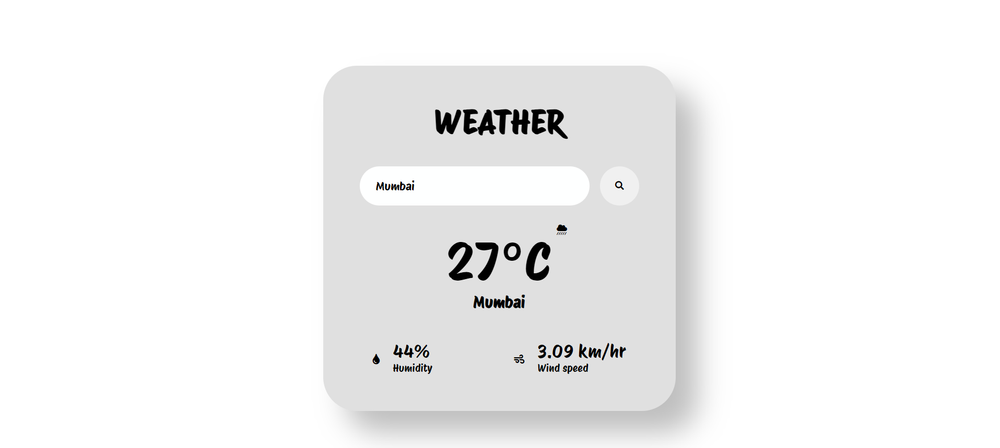

## Weather Website Readme

This is a simple weather website created using HTML, CSS, and JavaScript. It allows users to check the weather conditions of any city by entering the city name in the search box. The website fetches real-time weather data from the OpenWeatherMap API and displays it in a visually appealing manner.

### Features:

- **Search Functionality:** Users can enter the name of any city to get the current weather information.
- **Real-time Weather Updates:** The website fetches real-time weather data from the OpenWeatherMap API.
- **Responsive Design:** The website is designed to be responsive and works well on various screen sizes.

### Technologies Used:

- **HTML:** Used for structuring the web page.
- **CSS:** Used for styling the elements and making the website visually appealing.
- **JavaScript:** Used for fetching data from the API and updating the web page dynamically.

### How to Use:

1. Clone the repository to your local machine.
2. Open the `index.html` file in your web browser.
3. Enter the name of the city you want to check the weather for in the search box.
4. Click on the search button or press Enter.
5. The weather information for the entered city will be displayed on the screen.

### Credits:

- **Fonts:** The fonts used in this website are from Google Fonts.
- **Icons:** The icons used in this website are from Font Awesome.

### Preview:

### Author:

This weather website was created by [Aneesh R Rao].

### License:

This project is licensed under the [MIT License](LICENSE). Feel free to modify and use it according to your needs.
